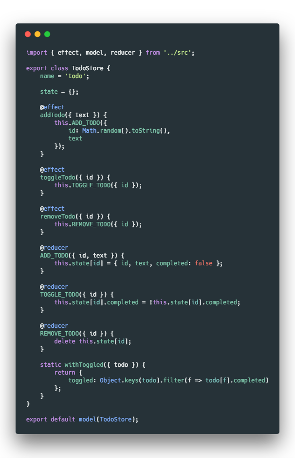

# rematch-model

Class-based models for [rematch](https://github.com/rematch/rematch), containing state, actions, reducers and selectors.


## Usage

Prerequisites:

[Rematch](https://rematch.gitbooks.io/rematch/#getting-started)

[Babel decorators](https://github.com/loganfsmyth/babel-plugin-transform-decorators-legacy)

#### With immer

[Rematch Immer Plugin](https://github.com/rematch/rematch/tree/master/plugins/immer)

All reducers can work with state immutabily (they becomes wrapped with [Immer](https://github.com/mweststrate/immer)'s `produce` behind the scenes):

```jsx harmony
    @reducer
    ADD_TODO({ id, text }) {
        this.state[id] = { id, text, completed: false };
    }
    
    @reducer
    TOGGLE_TODO({ id }) {
        this.state[id].completed = !this.state[id].completed;
    }
```


#### Without immer

Classic redux-style reducers, returning new state:

```jsx harmony
    @reducer
    TOGGLE_TODO({ id }) {
        return {
            ...this.state,
            [id]: {
                ...this.state[id],
                completed: !this.state[id].completed
            }
        };
    }
```

#### Connecting to React components with rematch-inject

[rematch-inject](https://github.com/today-/rematch-inject) transfers model's state and all public methods to your React class component:

```jsx harmony
@inject('todo')
class TodoList extends React.Component {
```

#### Connecting to components the old way

You can also connect store to your React component using [react-redux](https://github.com/reduxjs/react-redux) `connect` and mapStateToProps + mapDispatchToProps:

```jsx harmony
@connect(({ todo }) => ({ todo }), ({ todo }) => ({ ...todo }))
```

`connect` and `inject` can be also composed and used without decorators.

#### Selectors

Injecting static method of your model works as selector and connects dynamically calculated props to your component:

```jsx harmony
@inject(TodoStore.withToggled)
```

```jsx harmony
	static withToggled({ todo }) {
		return {
			toggled: Object.keys(todo).filter(f => todo[f].completed),
		};
	}
```

#### TypeScript

TypeScript examples:

[Store](./examples/todo-store-ts.ts)

[Injecting to components](./examples/todo-list-ts.tsx)

```typescript jsx
import { inject, Injected } from 'rematch-inject';

export type TodoListProps = 
    Injected<TodoStore> &
    Injected<typeof TodoStore.withToggled>;

@inject('todo')
@inject(TodoStore.withToggled)
export default class TodoList extends React.Component<TodoListProps> {
```

## Inspiration

[rematch-class-model](https://github.com/lyingd/rematch-class-model)

[MobX](https://github.com/mobxjs/mobx)
